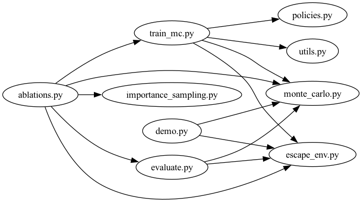

# 🎮 Escape Artist Agent  

An implementation of **Monte Carlo control** for a custom escape tactics game environment.  
The agent learns to escape a grid world, avoid traps, and reach the extraction point through trial and error.

This project demonstrates how **reinforcement learning (RL)** — specifically **on-policy and off-policy Monte Carlo methods** — can be applied to **game AI design**.

---

## 🚀 Features  
- ✅ On-policy **First-Visit** and **Every-Visit Monte Carlo Control**  
- ✅ Off-policy Monte Carlo with **Importance Sampling**  
- ✅ Custom **grid-based escape environment** with guards, traps, and goals  
- ✅ Visualizations: Q(s,a) heatmaps, trajectory overlays, episodic return plots  
- ✅ Comparisons with **Q-learning** for benchmarking  

---

## ⚙️ Installation
```bash
# Clone repository
git clone https://github.com/juansong/escape-artist-agent.git
cd escape-artist-agent

# Create Conda environment
conda env create -f environment.yml
conda activate escape-agent

# Or install via pip (recommended)
pip install -r requirements.txt

```

## 🛠️ Quick Usage

### 1️⃣ Train agent
```bash
python -m experiments.train_mc
```
- Saves `logs/q_table.pkl` and `logs/training_log.csv`.

### 2️⃣ Evaluate trained policy

```bash
python -m expeeriments.evaluate
```
- Computes **Success Rate**, **Average Steps**, **Detection Rate**.

### 3️⃣ Run demo

```bash
python -m demo
```
- Displays trained agent navigating the grid.
- Generates GIF in `docs/escape_demo.gif`.
---

## 📊 Results

### Training Performance
**Reward progression over episodes (reward curve)**:


- Shows how the agent learns to maximize cumulative reward  
- Average return over the last 100 episodes indicates stable policy  

### Evaluation Metrics

| Method                  | Success Rate ↑ | Avg Steps ↓ | Detection Rate ↓ |
|--------------------------|---------------|-------------|-----------------|
| First-Visit MC           | 72%           | 18.4        | 12%             |
| Every-Visit MC           | 76%           | 17.9        | 10%             |
| Off-Policy MC (IS)       | 80%           | 16.7        | 9%              |
| Q-Learning (baseline)    | 69%           | 19.5        | 15%             |

**Key insights:**  
- Monte Carlo control learns **safe navigation paths** but requires many episodes to converge.  
- **Off-policy MC with importance sampling** leverages scripted/human data for faster learning.  
- **Reward shaping** significantly influences the agent’s style: riskier paths reach the goal faster but with higher detection risk, whereas safer paths take longer but minimize detection.  

---

## 🧪Analysis & Visualization

```bash
jupyter notebook notebooks/analysis.ipynb
jupyter notebook notebooks/q_heatmaps.ipynb
```
- Use `notebooks/analysis.ipynb` to plot **episodic reward progression**.
- Use `notebooks/q_heatmaps.ipynb` to visualize **Q(s,a) heatmaps**.
- Metrics are logged in `logs/training_log.csv` for reproducibilty.

---

## 📂 Project Structure  
```
escape-artist-agent/
│
├── README.md                         <- Full portfolio README (intro, usage, demo, results)
├── requirements.txt                  <- All dependencies with tested versions
│
├── environment/
│   ├── escape_env.py                 <- Custom Escape environment with random traps
│   ├── utils.py                      <- Helpers: reward shaping, map loading
│   └── maps/                         <- ASCII/JSON maps
│
├── agent/
│   ├── monte_carlo.py                <- First-Visit Monte Carlo agent
│   ├── policies.py                   <- ε-soft policies, greedy updates
│   └── importance_sampling.py        <- Off-policy Monte Carlo methods
│
├── experiments/
│   ├── train_mc.py                   <- Training script (saves Q-table + training log)
│   ├── evaluate.py                   <- Policy evaluation script
│   ├── ablations.py                  <- Comparisons: MC vs Q-learning
│   └── config.yaml                   <- Hyperparameters
│
├── notebooks/
│   ├── analysis.ipynb                <- Plot training curves, average returns
│   └── q_heatmaps.ipynb              <- Visualize Q(s,a) heatmaps
│
├── logs/                             <- Automatically saved during training
│   ├── training_log.csv              <- Episode rewards per training run
│   └── q_table.pkl                   <- Saved Q-values for analysis/heatmaps
│
├── docs/                         
│   ├── training_rewards.png          <- Demo reward curve
│   ├── escape_demo.gif               <- Demo GIF of trained agent
│   └── dependency_graph.png          <- Dependency graph
│
├── scripts/                         
│   └── generate_dependency_graph.py  <- Generate ependency graph of each modules
│
└── demo.py                           <- Runs trained agent and generates GIF
```
---

## 📂 Code Dependency Graph

```bash
# Install Graphviz (macOS, Windows)
brew install graphviz
choco install graphviz

# Verify after installation
dot -V

# Run the script
python scripts/generate_dependency_graph.py
```

The graph illustrates how different modules in this project interact.

- **Main scripts** (`train_mc.py`, `evaluate.py`, `demo.py`) handle execution.
- **Agent modules** (`monte_carlo.py`, `importance_sampling.py`, `policies.py`) contain the logic.
- **Environment modules** (`escape_env.py`, `utils.py`) simulate the grid world, manage maps, and handle reward shaping.
- **Benchmark module** (`Ablations.py`) enables benchmarking and comparisons between methods.
- **Arrows** indicate import or usage dependencies.



---

### Demo
Demo Episode: A trained agent escaping the environment avoiding traps and reaching the goal:

```bash
python -m demo
```


---


## 📖 Notes
- **Python version**: 3.9+ recommended
- Traps are randomly generated each episode; the agent learns a robust policy
- The Q-table and reward logs allow full reproducibility and analysis
- GIF demo provides visual proof of the agent’s learning

--------