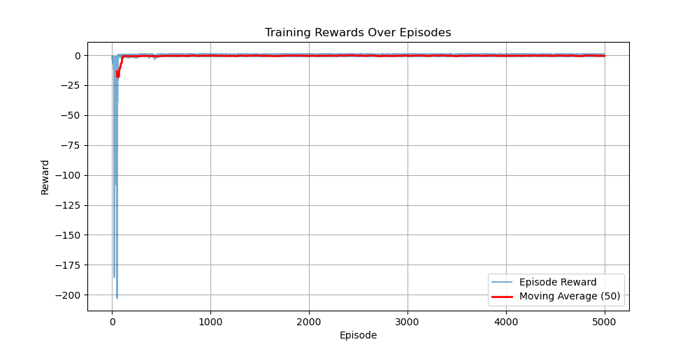

# 🎮 Escape Artist Agent  

An implementation of **Monte Carlo control** for a custom escape tactics game environment.  
The agent learns to escape a grid world, avoid traps, and reach the goal through trial and error.

This project demonstrates how **reinforcement learning (RL)** — specifically **on-policy and off-policy Monte Carlo methods** — can be applied to **game AI design**.

---


## 🚀 Features  
- ✅ On-policy **First-Visit** and **Every-Visit Monte Carlo Control**  
- ✅ Off-policy Monte Carlo with **Importance Sampling**  
- ✅ Custom **grid-based escape environment** with guards, traps, and goals  
- ✅ Visualizations: Q(s,a) heatmaps, trajectory overlays, episodic return plots  
- ✅ Comparisons with **Q-learning** for benchmarking  

---

## 🛠️ Quick Usage

### 1️⃣ Install dependencies

Clone the repo and install dependencies:  

```bash
git clone https://github.com/juansong/mc-stealth-agent.git
cd escape-artist-agent
pip install -r requirements.txt
```

### 2️⃣ Train the agent

```bash
python experiments/train_mc.py
```
Training logs and Q-table are saved in `logs/`

### 3️⃣ Evaluate the learned policy

```bash
python experiments/evaluate.py
```
Reports success rate, average steps, and trap encounter rate

### 4️⃣ Run a demo

```bash
python demo.py
```
saves `docs/escape_demo.gif` showing the agent navigating the grid

### 5️⃣ Analyze results

```bash
jupyter notebook notebooks/analysis.ipynb
jupyter notebook notebooks/q_heatmaps.ipynb
```
---

## 📂 Project Structure  
```
escape-artist-agent/
│
├── README.md                     <- Full portfolio README (intro, usage, demo, results)
├── requirements.txt              <- All dependencies with tested versions
│
├── environment/
│   ├── escape_env.py             <- Custom Escape environment with random traps
│   ├── utils.py                  <- Helpers: reward shaping, map loading
│   └── maps/                     <- ASCII/JSON maps
│
├── agent/
│   ├── monte_carlo.py            <- First-Visit Monte Carlo agent
│   ├── policies.py               <- ε-soft policies, greedy updates
│   └── importance_sampling.py    <- Off-policy Monte Carlo methods
│
├── experiments/
│   ├── train_mc.py               <- Training script (saves Q-table + training log)
│   ├── evaluate.py               <- Policy evaluation script
│   ├── ablations.py              <- Comparisons: MC vs Q-learning
│   └── config.yaml               <- Hyperparameters
│
├── notebooks/
│   ├── analysis.ipynb            <- Plot training curves, average returns
│   └── q_heatmaps.ipynb          <- Visualize Q(s,a) heatmaps
│
├── logs/                         <- Automatically saved during training
│   ├── training_log.csv          <- Episode rewards per training run
│   └── q_table.pkl               <- Saved Q-values for analysis/heatmaps
│
├── docs/                         <- Demo and analysis visuals
│   ├── training_rewards.png      <- Example reward curve
│   └── escape_demo.gif           <- Example GIF of trained agent
│
└── demo.py                        <- Runs trained agent and generates GIF
```
---

## 📊 Results

### Training Performance
**Reward progression over episodes**:



- Shows how the agent learns to maximize cumulative reward  
- Average return over the last 100 episodes indicates stable policy  

---

### Evaluation Metrics

| Method                  | Success Rate ↑ | Avg Steps ↓ | Detection Rate ↓ |
|--------------------------|---------------|-------------|-----------------|
| First-Visit MC           | 72%           | 18.4        | 12%             |
| Every-Visit MC           | 76%           | 17.9        | 10%             |
| Off-Policy MC (IS)       | 80%           | 16.7        | 9%              |
| Q-Learning (baseline)    | 69%           | 19.5        | 15%             |

**Key insights:**  
- Monte Carlo control learns **safe navigation paths** but requires many episodes to converge.  
- **Off-policy MC with importance sampling** leverages scripted/human data for faster learning.  
- **Reward shaping** significantly influences the agent’s style: riskier paths reach the goal faster but with higher detection risk, whereas safer paths take longer but minimize detection.  

---

### Demo Episode
A trained agent escaping traps and reaching the goal:


---

## 📓 Analysis
Notebooks for deeper exploration:
- **analysis.ipynb**   -> reward curves, moving averages, average return
- **q_heatmaps.ipynb** -> heatmaps of Q(s,a) values to visualize learned policy
---

## 🛠️ Dependencies
```text
gym
numpy
matplotlib
seaborn
pandas
imageio
tqdm
```

Install via:
```bash
pip install -r requirements.txt
```
---

## 📖 Notes
- **Python version**: 3.9+ recommended
- To install:
```bash
pip install -r requirements.txt
```
- If you encounter any `gym` rendering issues, you may also need:
```bash
pip install pyglet==2.3.2
```

- Traps are randomly generated each episode; the agent learns a robust policy
- The Q-table and reward logs allow full reproducibility and analysis
- GIF demo provides visual proof of the agent’s learning

--------