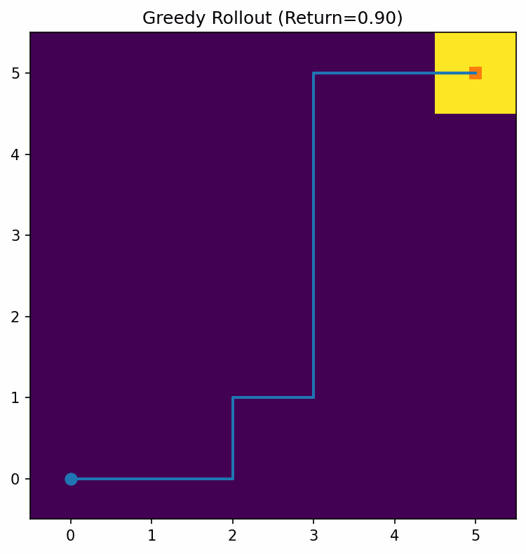

# 🎮 Escape Artist Agent

An implementation of Monte Carlo Control for a custom escape-tactics gridworld.
The agent learns to dodge randomly palced traps and navigate uncertain environments to reach the extraction point through trial and error.

This project demonstrates how reinforcement learning (RL) - specifically on/off policy Monte Carlo methods - can be appl9ied to game AI design,
A Q-learning baseline is included for comparison.

---

## 🚀 Features
- ✅ **Algorithms**
    - On-policy **Monte Carlo Control**: First-Visit & Every-Visit
    - **Off-policy MC**: ordinary & weighted **importance sampling**
    - **Q-Learning** baseline
- ✅ **Environment**
    - Gridworld with **random trap generation** (exclusion zones + solvability check)
    - Configurable **trap density**, **slip**, **time limit**, **safe radius**
    - **per_env** (fixed) or **per_episode** (new layout each episode)

- ✅ Reproducible & visual
    - Saved artifacts: `Q.npy`, `returns.npy`, `params.json`, `config_used.yaml`
    - Plots: **learning curve**, **value heatmap** + **greedy arrows**, **trajectory overlay**
    - Helper scripts for **combined curves**, **hero GIF**, and **layout montage**

- ✅ Tests & tooling
    - `pytest` unit tests (env invariants + learning sanity)
    - **Optional CI** workflow
    - **Makefile** shortcuts

---

## 🧩 Environment
- **State**: Agent position on the grid `(x,y)`; optional obs modes (`"pos"`, `"pos_oneshot"`, `"full_grid"`)
- **Actions**: `0:up, 1:right, 2:down, 3:left`.
- **Dynamics**:
    - **Traps** sampled by density ('trap_pct') with exclusion zones near start & goal.
    - **Solvability** check (BFS); resample if no path exists.
    - Optional slip (action replaced by a random neighbor with prob `p_slip`).
- **Rewards**:
    - Step cost `-0.01`
    - Trap `-1.0` (terminal if lethal)
    - Goal `+1.0`
- **Termination**: Reaching goal, lethal trap, or time limit (`max_steps`).
- **API**: Gymnasium-style
    - `reset(seed) -> (obs, info)`
    - `step(a) -> (obs, r, terminated, truncated, info)`

---

## 📂 Project Structure
```
escape-artist-agent/
  README.md
  pyproject.toml
  requirements.txt
  Makefile
  .gitignore
  LICENSE
  assets/
    .gitkeep
    README.md
  configs/
    easy.yaml
    medium.yaml
    hard.yaml
  escape_artist/
    __init__.py
    envs/
      __init__.py
      escape_env.py
      generators.py
    algos/
      __init__.py
      mc_control.py
      mc_offpolicy.py
      q_learning.py
    utils/
      __init__.py
      plotting.py
  experiments/
    run_experiment.py
    combine_curves.py
    make_hero_gif.py
    make_layout_montage.py
    ablations.py
    analysis.ipynb   # (optional) exploration & figure generation
  tests/
    test_generators.py
    test_env.py
    test_mc.py
    test_q_learning.py

```
---


## ⚙️ Install

Python ≥ 3.9 recommended.

```bash
# Clone repository
git clone https://github.com/juansong/escape-artist-agent.git
cd escape-artist-agent

# Install (packages and dev tools)
pip install -e .[dev]
# or: pip install -r requirements.txt

```

## 🛠️ Quickstart

Train on **medium** and auto-save artifacts & plots:

```bash
# MC (Every-Visit)
python -m experiments.run_experiment --algo mc --visit every \
  --episodes 8000 --config configs/medium.yaml --out runs/mc_every_medium

# Off-policy MC (Weighted IS)
python -m experiments.run_experiment --algo mc_off --is weighted \
  --episodes 12000 --config configs/medium.yaml --out runs/mc_off_weighted_medium

# Q-Learning
python -m experiments.run_experiment --algo q \
  --episodes 8000 --config configs/medium.yaml --out runs/q_medium
```

Rebuild plots later (without retraining):

```bash
python -m experiments.run_experiment --plot --from runs/q_medium
```

Makefile shortcuts:

```bash
make install
make train-medium
make figures
```
---

## 📊 Results

- Hero GIF (`assets/escape-artist-hero.gif`)
- Learning curves (`assets/curve_medium_mc_mc-off_q.png`)
- Value map & greedy arrows (`assets/heatmap_policy_medium.png`)
- Random layout montage (`assets/layout_montage.png`)

```bash
# Combined curves
python -m experiments.combine_curves \
  --runs runs/mc_every_medium runs/mc_off_weighted_medium runs/q_medium \
  --labels "MC (Every)" "MC-OFF (Weighted)" "Q-Learning" \
  --out assets/curve_medium_mc_mc-off_q.png

# Hero GIF (use rollout PNGs from each run)
python -m experiments.make_hero_gif \
  --frames runs/mc_every_medium/figs/greedy_rollout.png \
           runs/mc_off_weighted_medium/figs/greedy_rollout.png \
           runs/q_medium/figs/greedy_rollout.png \
  --out assets/escape-artist-hero.gif --fps 2

# Layout montage
python -m experiments.make_layout_montage \
  --rows 3 --cols 4 --size 10 10 --traps_pct 0.10 --slip 0.1 \
  --out assets/layout_montage.png

```

## 📈 Results

<p align="center">
  
</p>
<p align="center"><em>Greedy policy rollouts across random trap layouts (easy / medium / hard).</em></p>

**Evaluation setup.** Unless noted otherwise we use `configs/medium.yaml`, `layout_mode=per_episode`, and evaluate greedy rollouts from learned Q-tables over 200 randomized layouts. “Detection” means the agent stepped on any trap at least once during an episode. Raw numbers are saved to <code>assets/eval_medium.csv</code> for reproducibility.

### Evaluation metrics (medium)

<!-- Paste the auto-generated markdown table from assets/eval_medium.md below -->
<!-- Example:
| Method | Success Rate ↑ | Avg Steps ↓ | Detection Rate ↓ |
| --- | --- | --- | --- |
| Every-Visit MC | 76.0% | 17.9 | 10.0% |
| MC-OFF (Weighted) | 80.0% | 16.7 | 9.0% |
| Q-Learning | 69.0% | 19.5 | 15.0% |
-->

[Raw CSV](assets/eval_medium.csv)

---

### Learning curves (medium)


---

### Value map & greedy policy (fixed layout)


*(Generated on a fixed layout for readability; see `analysis.ipynb`.)*

---

### Layout diversity (per-episode sampling)


---

### Ablations (optional)

Success rate versus **trap density** × **slip**.

<table>
<tr>
<td></td>
<td></td>
</tr>
</table>

---

### Reproduce key figures

```bash
# Train three baselines on medium
python -m experiments.run_experiment --algo mc --visit every --episodes 8000 --config configs/medium.yaml --out runs/mc_every_medium
python -m experiments.run_experiment --algo mc_off --is weighted --episodes 12000 --config configs/medium.yaml --out runs/mc_off_weighted_medium
python -m experiments.run_experiment --algo q --episodes 8000 --config configs/medium.yaml --out runs/q_medium

# Evaluation table (+ CSV and markdown)
python -m experiments.evaluate \
  --config configs/medium.yaml --episodes 200 \
  --runs runs/mc_every_medium runs/mc_off_weighted_medium runs/q_medium \
  --labels "Every-Visit MC" "MC-OFF (Weighted)" "Q-Learning" \
  --out_csv assets/eval_medium.csv --out_md assets/eval_medium.md

# Combined learning curves
python -m experiments.combine_curves \
  --runs runs/mc_every_medium runs/mc_off_weighted_medium runs/q_medium \
  --labels "MC (Every)" "MC-OFF (Weighted)" "Q-Learning" \
  --out assets/curve_medium_mc_mc-off_q.png

# Fixed-layout overlays (produced via analysis notebook)
# -> assets/figs/value_heatmap_policy.png and assets/figs/greedy_rollout.png

# Layout montage
python -m experiments.make_layout_montage \
  --rows 3 --cols 4 --size 10 10 --traps_pct 0.10 --slip 0.1 \
  --out assets/layout_montage.png

```

---
## 📒 Notebooks

`experiments/analysis.ipynb` enables:
- combine learning curves
- render value heatmaps + rollouts on a fixed layout
- preview ablation CSVs

---

## 🧪 Tests
```bash
pytest -q
```

Covers:
- layout generation invariants
- env setup/termination/slip behavior
- MC & Q-Learning sanity on easy settings

---


## 📂 Project Structure  
```
escape-artist-agent/
│
├── README.md                         <- Full portfolio README (intro, usage, demo, results)
├── requirements.txt                  <- All dependencies with tested versions
│
├── environment/
│   ├── __init__.py
│   ├── escape_env.py                 <- Custom Escape environment with random traps
│   ├── utils.py                      <- Helpers: reward shaping, map loading
│   └── maps/                         <- ASCII/JSON maps
│
├── agent/
│   ├── __init__.py
│   ├── monte_carlo.py                <- First-Visit Monte Carlo agent
│   ├── policies.py                   <- ε-soft policies, greedy updates
│   └── importance_sampling.py        <- Off-policy Monte Carlo methods
│
├── experiments/
│   ├── __init__.py
│   ├── train_mc.py                   <- Training script (saves Q-table + training log)
│   ├── evaluate.py                   <- Policy evaluation script
│   ├── ablations.py                  <- Comparisons: MC vs Q-learning
│   └── config.yaml                   <- Hyperparameters
│
├── notebooks/
│   ├── analysis.ipynb                <- Plot training curves, average returns
│   └── q_heatmaps.ipynb              <- Visualize Q(s,a) heatmaps
│
├── logs/                             <- Automatically saved during training
│   ├── mc_training_log.csv           <- Episode rewards per MC run
│   ├── mc_q_table.pkl                <- MC Q-values
│   ├── mc_trajectories.pkl           <- Stored trajectories
│   ├── qlearning_training_log.csv    <- Q-Learning rewards
│   └── qlearning_q_table.pkl         <- Q-Learning Q-values
│
├── docs/                             <- Portfolio visuals
│   ├── training_rewards.png          <- Reward curve example
│   ├── escape_demo.gif               <- Demo GIF of trained agent
│   └── dependency_graph.png          <- Module dependency graph
│
├── scripts/
│   └── generate_dependency_graph.py  <- Generate dependency graph
│
└── demo.py                           <- Run trained agent and generate GIF
```

--------