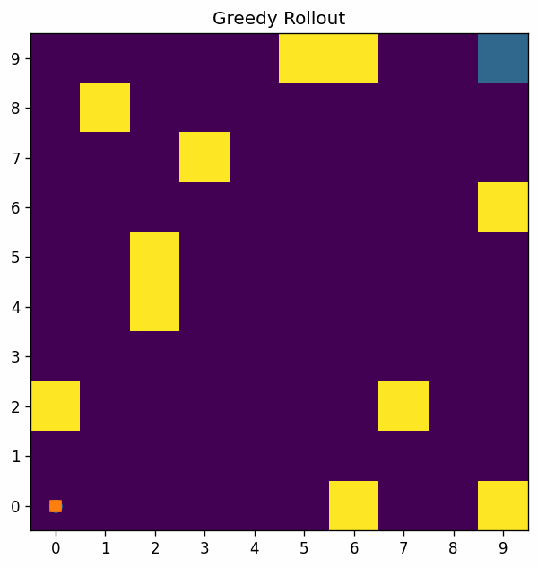
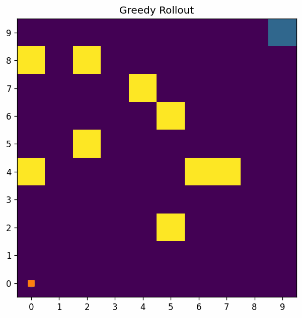
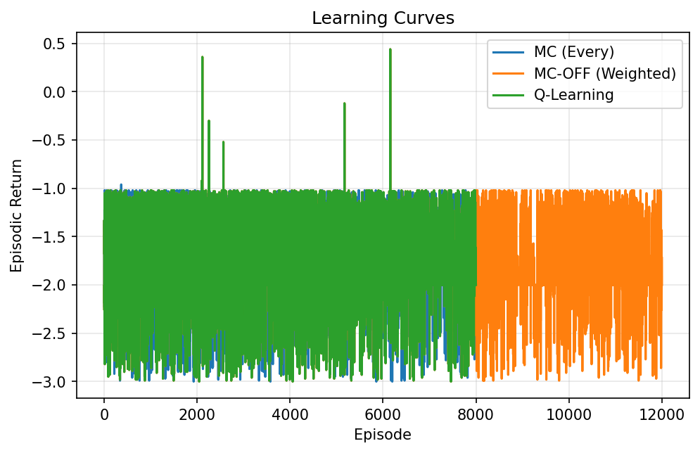
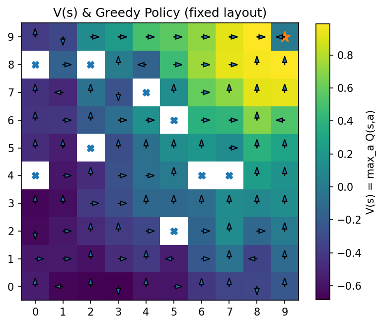
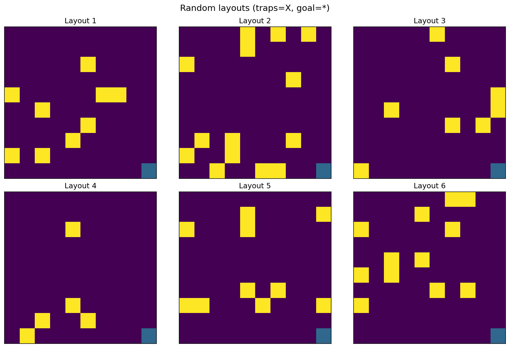
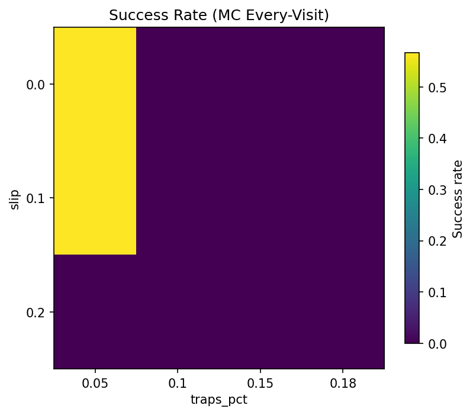
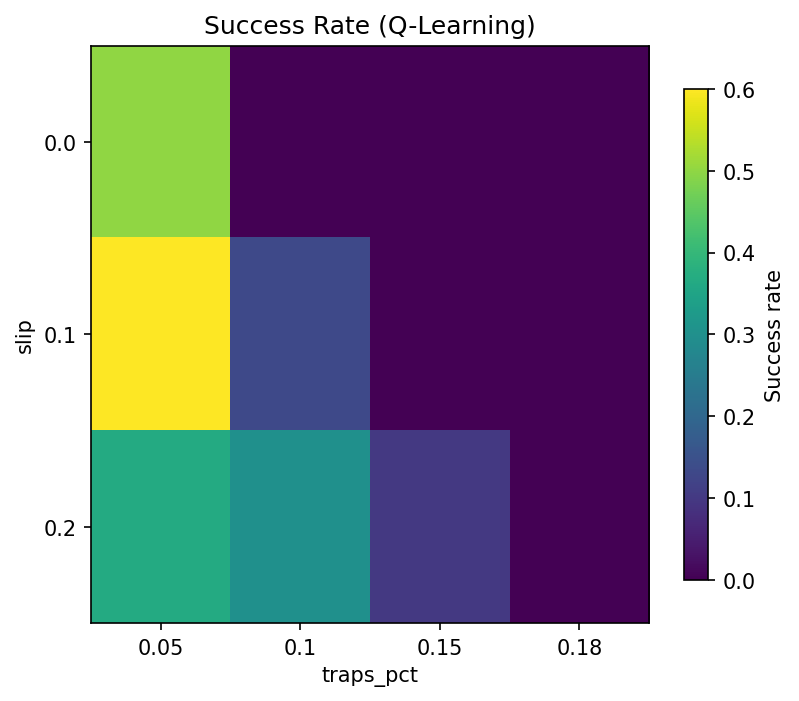

# 🎮 Escape Artist Agent

An implementation of Monte Carlo Control for a custom escape-tactics gridworld.
The agent learns to dodge randomly placed <code style="background-color: yellow;">traps</code> and navigate uncertain environments 
to reach the <code style="background-color: blue;">extraction point</code> through trial and error.
This project demonstrates how reinforcement learning (RL) - specifically on/off policy Monte Carlo methods - can be applied to game AI design, 
with Q-learning baseline for comparison.

<p align="center">
    
    
</p>
<p align="center"><em>Greedy policy rollouts across random trap layouts (successful/failed runs).</em></p>

---

## 🚀 Features
- ✅ **Algorithms**
    - On-policy **Monte Carlo Control**: First-Visit & Every-Visit
    - **Off-policy MC**: ordinary & weighted **importance sampling**
    - **Q-Learning** baseline
- ✅ **Environment**
    - Gridworld with **random trap generation** (exclusion zones + solvability check)
    - Configurable **trap density**, **slip**, **time limit**, **safe radius**
    - **per_env** (fixed) or **per_episode** (new layout each episode)

- ✅ Reproducible & visual
    - Saved artifacts: `Q.npy`, `returns.npy`, `params.json`, `config_used.yaml`
    - Plots: **learning curve**, **value heatmap** + **greedy arrows**, **trajectory overlay**
    - Helper scripts for **combined curves**, **hero GIF**, and **layout montage**

- ✅ Tests & tooling
    - `pytest` unit tests (env invariants + learning sanity)
    - **Optional CI** workflow
    - **Makefile** shortcuts

---

## 🧩 Environment
- **State**: Agent position on the grid `(x,y)`; optional obs modes (`"pos"`, `"pos_oneshot"`, `"full_grid"`)
- **Actions**: `0:up, 1:right, 2:down, 3:left`.
- **Dynamics**:
    - **Traps** sampled by density ('trap_pct') with exclusion zones near start & goal.
    - **Solvability** check (BFS); resample if no path exists.
    - Optional slip (action replaced by a random neighbor with prob `p_slip`).
- **Rewards**:
    - Step cost `-0.01`
    - Trap `-1.0` (terminal if lethal)
    - Goal `+1.0`
- **Termination**: Reaching goal, lethal trap, or time limit (`max_steps`).
- **API**: Gymnasium-style
    - `reset(seed) -> (obs, info)`
    - `step(a) -> (obs, r, terminated, truncated, info)`

---

## 📂 Project Structure  
```
escape-artist-agent/
│
├── README.md                         <- Portfolio README
├── pyproject.toml                    <- Package (installable library)
├── requirements.txt                  <- (Optional) for quick install
├── Makefile                          <- Shortcuts (train, figures, eval, clean)
├── .gitignore                        <- Ignore runs/ artifacts, caches, editor files
├── LICENSE                           <- GNU license
│
├── assets/                           <- Curated visuals & tables used in README
│ ├── README.md
│ ├── .gitkeep                        <- Placeholder file
│ └── figs/                           <- Outputs from notebook (value heatmap, rollout)
│
├── configs/                          <- Difficulty presets (env + algo defaults)
│ ├── easy.yaml
│ ├── medium.yaml
│ └── hard.yaml
│
├── escape_artist/                    <- Installable Python package (envs, algos, utils)
│ ├── init.py
│ ├── envs/                           <- Grid env + random trap generators
│ │ ├── init.py
│ │ ├── escape_env.py                 <- Gymnasium-style gridworld with traps/goal/slip
│ │ └── generators.py                 <- Layout sampling, solvability(BFS), exclusion masks
│ ├── algos/                          <- Learning algorithms
│ │ ├── init.py
│ │ ├── mc_control.py                 <- On-policy MC (first/every) + greedy rollout
│ │ ├── mc_offpolicy.py               <- Off-policy MC (importance sampling)
│ │ └── q_learning.py                 <- Tabular Q-learning baseline
│ └── utils/
│ ├── init.py
│ └── plotting.py                     <- Learning curve, value heatmap, rollout plots
│
├── experiments/                      <- CLI + analysis (run from repo root)
│ ├── init.py
│ ├── run_experiment.py               <- Train or re-plot from a saved run dir
│ ├── evaluate.py                     <- Greedy eval → CSV + Markdown (incl. timeout rate)
│ ├── combine_curves.py               <- Merge multiple learning curves
│ ├── make_hero_gif.py                <- Build demo GIF from rollout PNGs
│ ├── make_layout_montage.py          <- Tile random layouts into a montage
│ ├── ablations.py                    <- Abalation study - parameter sweeps (traps_pct × slip)
│ └── analysis.ipynb                  <- Optional notebook for visuals/figures
│
├── tests/                            <- Pytest: env invariants + learning sanity
│ ├── test_generators.py
│ ├── test_env.py
│ ├── test_mc.py
│ └── test_q_learning.py
│
├── docs/                             <- CLI walkthrough & Developer guide
└── runs/                             <- Training outputs (gitignored; artifacts + figs/)

```
---


## ⚙️ Install

Python ≥ 3.9 recommended.

```bash
# Clone repository
git clone https://github.com/juansong/escape-artist-agent.git
cd escape-artist-agent

# Install (packages and dev tools)
python -m pip install --upgrade pip
python -m pip install -e .[dev]

```

## 🛠️ Quickstart (CLI)

Train on **medium** and auto-save artifacts & plots:

```bash
# MC (Every-Visit)
python -m experiments.run_experiment --algo mc --visit every \
  --episodes 8000 --config configs/medium.yaml --out runs/mc_every_medium

# Off-policy MC (Weighted IS)
python -m experiments.run_experiment --algo mc_off --is weighted \
  --episodes 12000 --config configs/medium.yaml --out runs/mc_off_weighted_medium

# Q-Learning
python -m experiments.run_experiment --algo q \
  --episodes 8000 --config configs/medium.yaml --out runs/q_medium
```

Rebuild plots later (without retraining):

```bash
python -m experiments.run_experiment --plot --from runs/q_medium
```

Makefile shortcuts:

```bash
make install
make train-medium
make figures
```
---

## 📊 Results

#### ***Evaluation setup**
Unless noted otherwise we use `configs/medium.yaml`, `layout_mode=per_episode`, and evaluate greedy rollouts from learned Q-tables over 200 randomized layouts. “Detection” means the agent stepped on any trap at least once during an episode. Raw numbers are saved to <code>assets/eval_medium.csv</code> for reproducibility.

#### ***Note** 
Results emphasize **generalization**. We evaluate on **per-episode randomized layouts** (no map memorization). Medium uses 10×10 grids, 10% traps, 10% slip, lethal traps. Failures are mostly trap hits; timeouts are reported explicitly.

### Evaluation metrics — Easy

*(6×6, per-episode, lethal traps; 200 randomized layouts; greedy rollouts from learned Q)*

<!-- Paste the contents of assets/eval_easy.md below this line -->
| Method | Success Rate ↑ | Avg Steps ↓ | Detection Rate ↓ | Timeout Rate ↓ |
| --- | --- | --- | --- | --- |
| MC (First) | 91.5% | 10.0 | 8.5% | 0.0% |
| Q-Learning | 88.0% | 10.0 | 12.0% | 0.0% |
<!-- END:EVAL_TABLE_EASY -->

[Raw CSV](assets/eval_easy.csv)

---

### Evaluation metrics — Medium

*(10×10, per-episode, 10% traps, 10% slip, lethal; 200 randomized layouts; greedy rollouts from learned Q)*

| Method | Success Rate ↑ | Avg Steps ↓ | Detection Rate ↓ |
| --- | --- | --- | --- |
| Every-Visit MC (12k) | 21.5% | 19.4 | 78.5% |
| MC-OFF (Weighted, 18k) | 20.5% | 19.8 | 79.5% |
| Q-Learning (12k) | 23.0% | 20.6 | 77.0% |


[Raw CSV](assets/eval_medium.csv)

---

### Learning curves (medium)



---

### Value map & greedy policy (fixed layout)



*(Generated on a fixed layout for readability; see `analysis.ipynb`.)*

---

### Layout diversity (per-episode sampling)



---

### Ablations (optional)

Success rate versus **trap density** × **slip**.

<table>
<tr>
<td></td>
<td></td>
</tr>
</table>

---

### Reproduce key figures

```bash
# Train three baselines on medium
python -m experiments.run_experiment --algo mc --visit every --episodes 8000 --config configs/medium.yaml --out runs/mc_every_medium
python -m experiments.run_experiment --algo mc_off --is weighted --episodes 12000 --config configs/medium.yaml --out runs/mc_off_weighted_medium
python -m experiments.run_experiment --algo q --episodes 8000 --config configs/medium.yaml --out runs/q_medium

# Evaluation table (+ CSV and markdown)
python -m experiments.evaluate \
  --config configs/medium.yaml --episodes 200 \
  --runs runs/mc_every_medium runs/mc_off_weighted_medium runs/q_medium \
  --labels "Every-Visit MC" "MC-OFF (Weighted)" "Q-Learning" \
  --out_csv assets/eval_medium.csv --out_md assets/eval_medium.md

# Combined learning curves
python -m experiments.combine_curves \
  --runs runs/mc_every_medium runs/mc_off_weighted_medium runs/q_medium \
  --labels "MC (Every)" "MC-OFF (Weighted)" "Q-Learning" \
  --out assets/curve_medium_mc_mc-off_q.png

# Fixed-layout overlays (produced via analysis notebook)
# -> assets/figs/value_heatmap_policy.png and assets/figs/greedy_rollout.png

# Layout montage
python -m experiments.make_layout_montage \
  --rows 3 --cols 4 --size 10 10 --traps_pct 0.10 --slip 0.1 \
  --out assets/layout_montage.png

```

---
## 📒 Notebooks

`experiments/analysis.ipynb` enables:
- combine learning curves
- render value heatmaps + rollouts on a fixed layout
- preview ablation CSVs

---

## 🧪 Tests
```bash
pytest -q
```

Covers:
- layout generation invariants
- env setup/termination/slip behavior
- MC & Q-Learning sanity on easy settings

---

## 📂 Documentation
- **[Full CLI walkthrough](docs/CLI_WALKTHROUGH.md)** — end-to-end training, plotting, evaluation (easy + medium), GIFs, and tips.
- **[Developer Guide](docs/DEVELOPER_GUIDE.md)** - full docstrings and additional notes.
- **[PPT](docs/underprogress.pptx)** - portfolio ppt.

--------